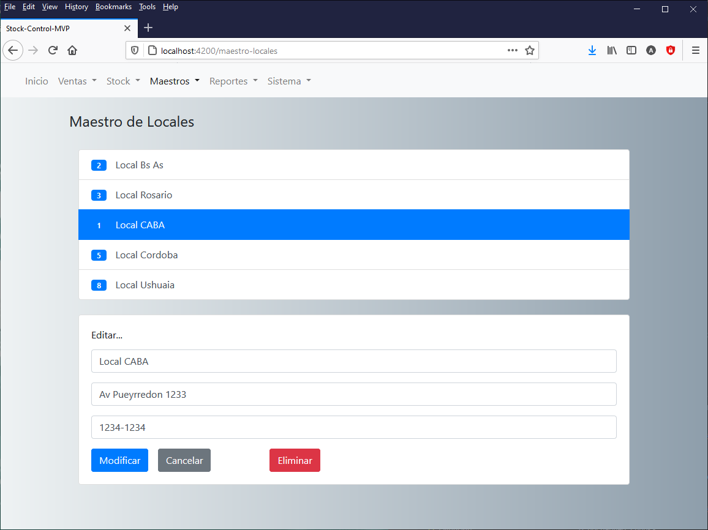

# Stock Control Software

A Stock Control Software (minimum valid product) for a clothing business.  
[LIVE DEMO HERE](https://andres-garcia-alves.github.io/stock-control-mvp/).  

Current working modules/operations:
- sales > register sale
- sales > view sales
- stock > update stock
- stock > drop defective
- stock > transfer between branches
- master > branches master
- master > products master
- master > providers master
- master > users master
- system > change password

&nbsp;

### Screenshots

| sales > view sales                    | master > branches master              |
|---------------------------------------|---------------------------------------|
|  |  |

&nbsp;

This project was generated with [Angular CLI](https://github.com/angular/angular-cli) version 8.3.8.  
Updated up to Angular version 12.0.0.  

&nbsp;

### Development server

Run `ng serve` for a dev server. Navigate to `http://localhost:4200/`. The app will automatically reload if you change any of the source files.

### Code scaffolding

Run `ng generate component component-name` to generate a new component. You can also use `ng generate directive|pipe|service|class|guard|interface|enum|module`.

### Build

Run `ng build` to build the project. The build artifacts will be stored in the `dist/` directory.  
Use the `--configuration production` flag for a production build.  
Use the `--configuration gh-pages --base-href="https://andres-garcia-alves.github.io/stock-control-mvp/"` flag for a GitHub-Pages build.

### Running unit tests

Run `ng test` to execute the unit tests via [Karma](https://karma-runner.github.io).

### Running end-to-end tests

Run `ng e2e` to execute the end-to-end tests via [Protractor](http://www.protractortest.org/).

### Further help

To get more help on the Angular CLI use `ng help` or go check out the [Angular CLI README](https://github.com/angular/angular-cli/blob/master/README.md).

&nbsp;

### Version History

v1.0 (2021.05.26) - Initial release.  

&nbsp;

This is the first public release of this project.  
Developed for subject 'Ingenieria de Software II', at CAECE University, Buenos Aires, Argentina.  

This source code is licensed under MIT licence.  
Please send me your feedback about this project: andres.garcia.alves@gmail.com
